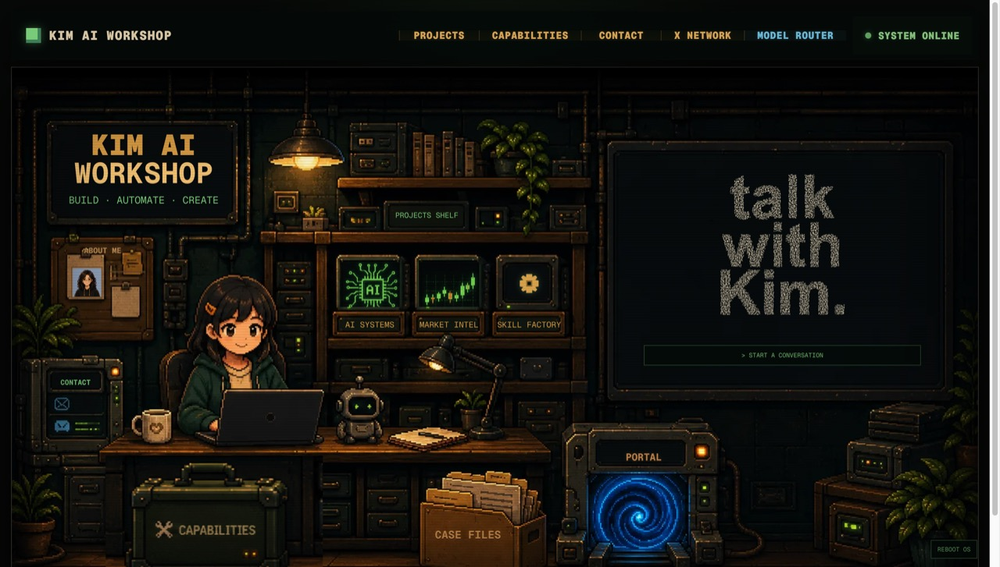

# 菜单 · 我帮你做的个人官网

> 先看风格，选一个最像你的，剩下的交给我。三天交付，改到满意。
> 报价为**起步价**，按内容量 / 是否买独立域名浮动；首单试做价可谈。

---

## 风格 A · 极简名片（¥99 起）

**一句话**：名字 + 一句人设 + 一个「先聊聊」按钮，信息极轻，专为让人快速联系你。

- **适合谁**：创业者、自由职业者、服务型个人品牌——只想让客户知道「我在做什么 + 怎么找我」。
- **参考**：[mc9world.com](https://mc9world.com)

---

## 风格 B · 作品与内容陈列站（¥199 起）

**一句话**：项目 / 博客 / 技能 / 精华帖子分层陈列，把「你做过什么、正在做什么」一次讲清。

- **适合谁**：独立开发者、内容创作者——有作品有内容，需要一个能撑起来的主页。
- **参考**：[chendahuang.com](https://chendahuang.com)

---

## 风格 C · 内容与社区站（¥199 起）

**一句话**：把你在各平台的干货沉淀成「实战手册」列表，内容即产品，顺便导流社群。

- **适合谁**：教程/科普作者、做社群的人——想用内容留住人、并把人引到私域。
- **参考**：[coucouya.com](https://coucouya.com)

---

## 风格 D · AI 产品作品集（¥199 起）

**一句话**：用真实产品案例 + 工作流能力标签证明专业度，每个产品都讲清「解决什么问题」。

- **适合谁**：AI 产品开发者、自动化工具作者——用作品当简历，让客户秒懂你会什么。
- **参考**：[edison-zwteam.pages.dev](https://edison-zwteam.pages.dev)

---

## 风格 E · 视觉工作室（¥299 起）

**一句话**：3D 开场抓眼球，服务 + 作品 + 开源四块陈列，中英双语，品牌感拉满。

- **适合谁**：设计师、独立工作室、AI 工作流顾问——需要「一眼高级」来抬身价。
- **参考**：[su-uni.cc](https://su-uni.cc)

---

## 风格 F · 互动像素工作室（¥399 起）

**一句话**：开机动画 + 点得动的像素世界，项目/能力/案例/人脉图谱全藏在场景里，访客玩着玩着就把你记住了。

- **适合谁**：AI Builder、自动化工具作者、想让人眼前一亮的极客——要的是记忆点，不是一页简历。
- **参考**：[kim-ai-workshop.com](https://kim-ai-workshop.com) · 作者 X：[@king1818888](https://x.com/king1818888)

---

## 交付包含

- 选中风格后，按你的资料改内容：人设一句话、项目/作品、社交链接、邮箱
- 部署上线（Vercel / Cloudflare Pages，先免费托管）
- 独立域名（可选，域名费用你自付，我帮你配置）
- 三天交付，改到满意

## 怎么开始

告诉我「我想要风格 X」+ 你的资料（一句话介绍 + 3~5 个项目/作品 + 联系方式），我先给你试做。
