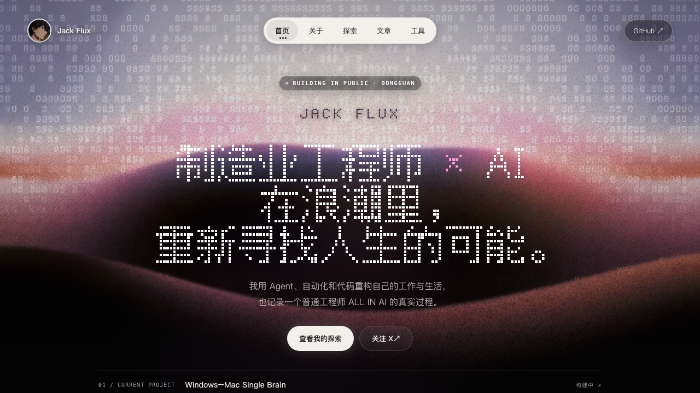
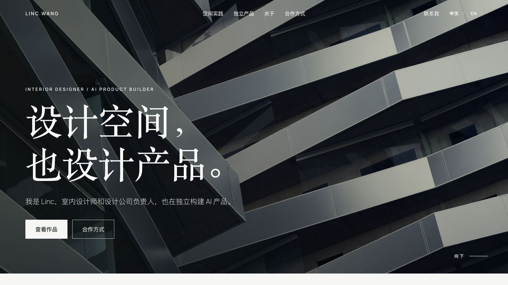

# 菜单 · 我帮你做的个人官网

> 先看风格，选一个最像你的，剩下的交给我。三天交付，改到满意。
> 报价为**起步价**，按内容量 / 是否买独立域名浮动；首单试做价可谈。

**联系方式**：邮箱 chendanhuang31016@gmail.com · X [@realchendahuang](https://x.com/realchendahuang) · 闲鱼站内搜「个人网站定制」

---

## 风格 A · 极简名片（¥99 起）

**一句话**：名字 + 一句人设 + 一个「先聊聊」按钮，信息极轻，专为让人快速联系你。

- **适合谁**：创业者、自由职业者、服务型个人品牌——只想让客户知道「我在做什么 + 怎么找我」。
- **亮点**：业务关键词直接进网站标题；「先聊聊」按钮为私聊成交设计；搭建最快、改起来最省事。
- **参考**：[mc9world.com](https://mc9world.com) · 站长 Mike Lam：[@MikeLammm](https://x.com/MikeLammm)

---

## 风格 B · 作品与内容陈列站（¥199 起）

**一句话**：项目 / 博客 / 技能 / 精华帖子分层陈列，把「你做过什么、正在做什么」一次讲清。

- **适合谁**：独立开发者、内容创作者——有作品有内容，需要一个能撑起来的主页。
- **亮点**：Hero 一句话亮出全部身份标签；项目 / 博客 / 手册 / 技能 / 精华分层；暗色科技感。
- **参考**：[chendahuang.com](https://chendahuang.com) · 站长 陈大黄：[GitHub](https://github.com/realchendahuang)

---

## 风格 C · 内容与社区站（¥199 起）

**一句话**：把你在各平台的干货沉淀成「实战手册」列表，内容即产品，顺便导流社群。

- **适合谁**：教程 / 科普作者、社群主理人——想用内容留住人、再把人引到私域。
- **亮点**：长文沉淀成站内手册；教程 / 图文 / 书评分块陈列；Telegram + X 双向导流。
- **参考**：[coucouya.com](https://coucouya.com) · 站长 可可鸭：[@KeKeYa88](https://x.com/KeKeYa88)

---

## 风格 D · AI 产品作品集（¥199 起）

**一句话**：用真实产品案例 + 工作流能力标签证明专业度，每个产品都讲清「解决什么问题」。

- **适合谁**：AI 产品开发者、自动化工具作者——用作品当简历，让客户秒懂你会什么。
- **亮点**：产品从「解决什么问题」讲起；能力标签化（知识库 / 流程 / 分发）方便客户速查。
- **参考**：[edison-zwteam.pages.dev](https://edison-zwteam.pages.dev) · 站长 Edison：[@Edison_aware](https://x.com/Edison_aware)

---

## 风格 E · 视觉工作室（¥299 起）

**一句话**：3D 开场抓眼球，服务 + 作品 + 开源四块陈列，中英双语，品牌感拉满。

- **适合谁**：设计师、独立工作室、AI 工作流顾问——需要「一眼高级」来抬身价。
- **亮点**：3D WebGL 开场；服务 / 作品 / 开源 / 能力四块；开源项目挂首页当信任背书；中英双语。
- **参考**：[su-uni.cc](https://su-uni.cc) · 站长 Su：[GitHub](https://github.com/doublesq97-ui)

---

## 风格 F · 互动像素工作室（¥399 起）

**一句话**：开机动画 + 点得动的像素世界，项目 / 能力 / 案例 / 人脉图谱全藏在场景里，访客玩着玩着就把你记住了。

- **适合谁**：AI Builder、自动化工具作者、想让人眼前一亮的极客——要的是记忆点，不是一页简历。
- **亮点**：可玩的小世界，停留时长远超普通页面；人脉做成可交互 X 关系图谱；场景即导航。
- **参考**：[kim-ai-workshop.com](https://kim-ai-workshop.com) · 站长 Kimberly：[@king1818888](https://x.com/king1818888)

---

## 风格 G · 极客成长记录站（¥199 起）

**一句话**：数字雨 + 点阵大字开场，项目、文章、AI 工作台按编号陈列，公开记录一个工程师 ALL IN AI 的全过程。

- **适合谁**：正在转型、正在深耕的工程师和开发者——把成长过程摊开来做信任资产。
- **亮点**：首页宣言 + 「当前项目」滚动条；项目挂「构建中 / 运行中 / 迭代中」状态标签；AI 工作台亮出工具栈。
- **参考**：[jack0813y.github.io](https://jack0813y.github.io) · 站长 Jack Flux：[X @Jack_FluxAI](https://x.com/Jack_FluxAI)

---

## 风格 H · 设计实践 × AI 产品（¥299 起）

**一句话**：先交代专业主业（室内设计），再陈列可直接体验的 AI 产品，用杂志式留白把双重身份讲成一个清晰叙事。

- **适合谁**：有明确专业主业、同时在构建数字产品的独立设计师、工作室负责人、跨界创作者。
- **亮点**：专业根基先行，不做泛泛的 AI 标签墙；建筑摄影 + 衬线标题的高级感；真实产品界面与 Demo 入口承担可信度；中英双语 + 减少动效支持。
- **参考**：[linc.wang](https://linc.wang) · 站长 Linc：[@superwang](https://x.com/superwang)

---

## 交付包含

- 选中风格后，按你的资料改内容：人设一句话、项目/作品、社交链接、邮箱
- 部署上线（Vercel / Cloudflare Pages，先免费托管）
- 独立域名（可选，域名费用你自付，我帮你配置）
- 三天交付，改到满意

## 怎么开始

告诉我「我想要风格 X」+ 你的资料（一句话介绍 + 3~5 个项目/作品 + 联系方式），我先给你试做。

拿不准风格就说「我想要 A 的排版 + B 的感觉」，混合也可以。
