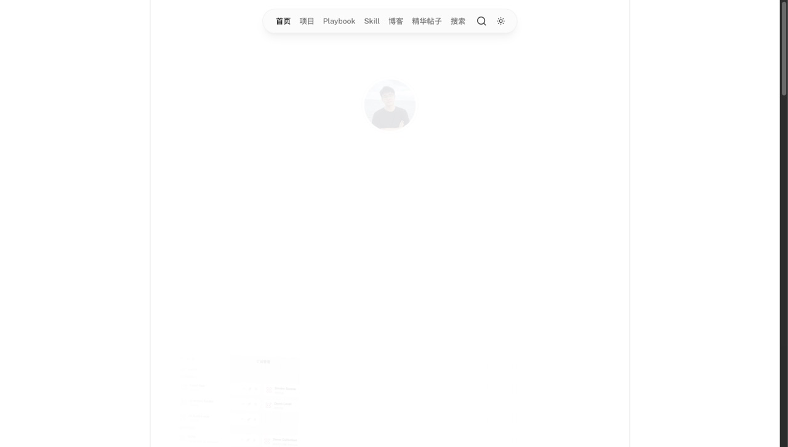
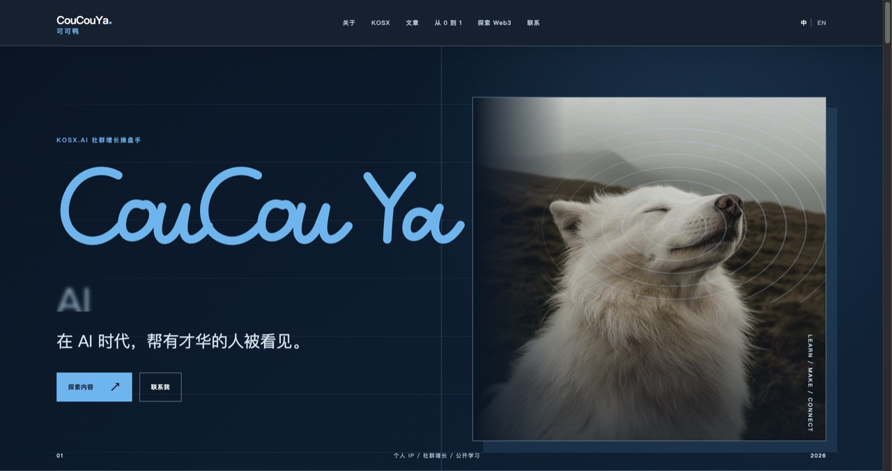
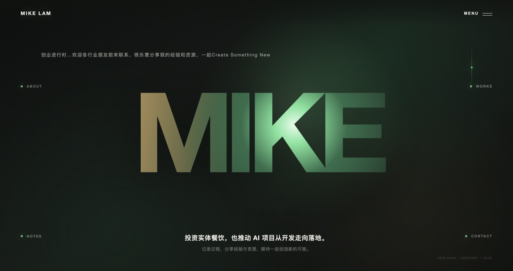
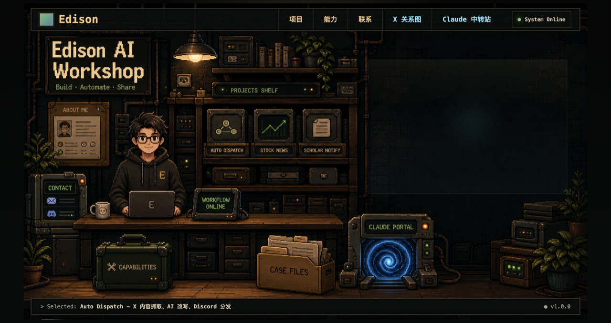
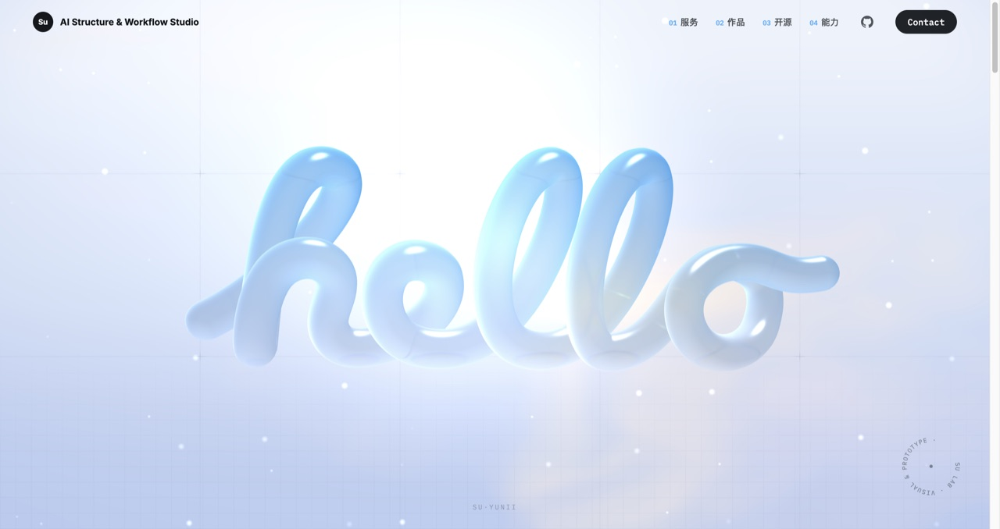

# Personal-website-ai

> AI 时代，属于你的数字名片站。  
> In the AI era, a digital business card that belongs to you.

[English below →](#english)

---

## 项目名字候选（未定）

| 候选 | 含义 |
|------|------|
| **MeSite** | 我的站点，直白好记 |
| **AutoMePage** | 自动生成我的主页，突出自动化 |
| **NexMe** | 新一代个人数字主页，简约高级 |
| **HostMe** | 托管 + 建站全包，不用管部署 |
| **BuildMeAI** | AI 帮你搭建个人站点 |

## 项目初心

AI 时代，让每个人都能拥有一张属于自己的**数字名片** —— 一个完整、美观、免维护的个人官网，由 AI 自动搭建。

## 模板库（里程碑 1：持续收集）

下面是我们收集到的个人主页/数字名片模板预览。每个模板都配有**首页截图、主页链接、GitHub（如有）、参考分析文档**。

新模板会按同样格式持续补充。

---

### 001 · 陈大黄 · 作品与内容陈列站

- **主页**：[chendahuang.com](https://chendahuang.com)
- **GitHub**：[realchendahuang/chendahuang.com](https://github.com/realchendahuang/chendahuang.com)
- **分析文档**：[templates/chendahuang.com.md](templates/chendahuang.com.md)
- **特点**：Nuxt3 + Cloudflare，暗色科技感；项目 / 博客 / Playbook / 技能 / 精华帖子多内容分层；适合独立开发者与内容创作者。

---

### 002 · CouCouYa 可可鸭 · 社区增长 / 公开学习

- **主页**：[coucouya.com](https://coucouya.com)
- **GitHub**：—
- **分析文档**：[templates/coucouya.com.md](templates/coucouya.com.md)
- **特点**：暗色内容站，AI 时代社区增长操盘手；教程、Web3 探索、社群导流。适合个人 IP / 内容创作者。

---

### 003 · Mike Lam · 创业者个人主页

- **主页**：[mc9world.com](https://mc9world.com)
- **GitHub**：—
- **分析文档**：[templates/mc9world.com.md](templates/mc9world.com.md)
- **特点**：WordPress，极简大字 Hero，"先聊聊"式 CTA；适合创业者 / 服务型个人品牌。

---

### 004 · Edison AI Workshop · AI 产品开发者作品集

- **主页**：[edison-zwteam.pages.dev](https://edison-zwteam.pages.dev)
- **GitHub**：—
- **分析文档**：[templates/edison-zwteam.pages.dev.md](templates/edison-zwteam.pages.dev.md)
- **特点**：Cloudflare Pages，像素风工作室场景；产品案例 + 工作流能力；适合 AI 产品开发者 / 自动化工具开发者。

---

### 005 · Su · AI Structure & Workflow Studio · 视觉与原型工作室

- **主页**：[su-uni.cc](https://su-uni.cc)
- **GitHub**：[doublesq97-ui](https://github.com/doublesq97-ui)
- **分析文档**：[templates/su-uni.cc.md](templates/su-uni.cc.md)
- **特点**：WebGL 3D Hero 视觉冲击；服务 + 作品 + 开源 + 能力四块陈列；中英双语；适合设计师 / 工作室 / AI 工作流顾问。

---

## 里程碑路线图

### 里程碑 1：模板收集（当前阶段）
收集好个人博客模板，把审美好、设计好的模板收集起来，做成一个**模板展示页面**，方便给用户浏览挑选。

### 里程碑 2：流水线 SOP 化
把搭建网站、购买域名、部署这些事情 SOP 化，组成一个**半自动的流水线流程**。

### 里程碑 3：获客盈利
开始获客、推销、开始盈利成交，然后讨论**合作分润**方式。

### 里程碑 4：SaaS 化
把这一套东西形成一个 **SaaS**：全自动发货、全自动运行、全自动收钱。

### 里程碑 5：规模化推广
加速推广、持续获客，根据个性化需求**持续迭代**。

---

# English

## Project Name Candidates (not finalized)

| Candidate | Meaning |
|-----------|---------|
| **MeSite** | My site, simple and memorable |
| **AutoMePage** | Auto-generate my homepage, zero effort |
| **NexMe** | Next-gen personal digital hub, minimal and premium |
| **HostMe** | Hosting + site building all-in-one |
| **BuildMeAI** | AI builds your personal site |

## Vision

In the AI era, everyone deserves their own **digital business card** — a complete, beautiful, maintenance-free personal website, auto-built by AI.

## Template Gallery (Milestone 1)

A collection of personal homepages / digital business card templates. Each template includes a **homepage screenshot, live URL, GitHub (if any), and a reference document**.

### 001 · Chen Dahuang · Portfolio & Content Hub

- **Homepage**：[chendahuang.com](https://chendahuang.com)
- **GitHub**：[realchendahuang/chendahuang.com](https://github.com/realchendahuang/chendahuang.com)
- **Reference**：[templates/chendahuang.com.md](templates/chendahuang.com.md)
- **Highlights**：Nuxt3 + Cloudflare, dark tech aesthetic; projects / blog / playbooks / skills / highlights; great for indie hackers and creators.

---

### 002 · CouCouYa · Community Growth & Learning in Public

- **Homepage**：[coucouya.com](https://coucouya.com)
- **GitHub**：—
- **Reference**：[templates/coucouya.com.md](templates/coucouya.com.md)
- **Highlights**：Dark content site; tutorials, Web3 exploration, community growth. For personal IP and content creators.

---

### 003 · Mike Lam · Entrepreneur Personal Homepage

- **Homepage**：[mc9world.com](https://mc9world.com)
- **GitHub**：—
- **Reference**：[templates/mc9world.com.md](templates/mc9world.com.md)
- **Highlights**：WordPress, bold typography hero, "let's talk" CTA. For entrepreneurs and service-oriented personal brands.

---

### 004 · Edison AI Workshop · AI Product Developer Portfolio

- **Homepage**：[edison-zwteam.pages.dev](https://edison-zwteam.pages.dev)
- **GitHub**：—
- **Reference**：[templates/edison-zwteam.pages.dev.md](templates/edison-zwteam.pages.dev.md)
- **Highlights**：Cloudflare Pages, pixel-art workshop scene; product cases + workflow capabilities. For AI product developers and automation tool builders.

---

### 005 · Su · AI Structure & Workflow Studio · Visual & Prototype Studio

- **Homepage**：[su-uni.cc](https://su-uni.cc)
- **GitHub**：[doublesq97-ui](https://github.com/doublesq97-ui)
- **Reference**：[templates/su-uni.cc.md](templates/su-uni.cc.md)
- **Highlights**：WebGL 3D hero with strong visual impact; services + works + open source + capabilities; bilingual. For designers / studios / AI workflow consultants.

---

## Milestone Roadmap

1. **Template Collection (current)** — Collect beautiful personal-site templates and build a gallery.
2. **Pipeline SOP** — SOP-ify site building, domain purchase, and deployment into a semi-automated pipeline.
3. **Customer Acquisition & Revenue** — Start selling and discuss profit-sharing.
4. **SaaS-ify** — Fully automated delivery, operation, and payment.
5. **Scale & Iterate** — Accelerate promotion and iterate on personalized needs.
