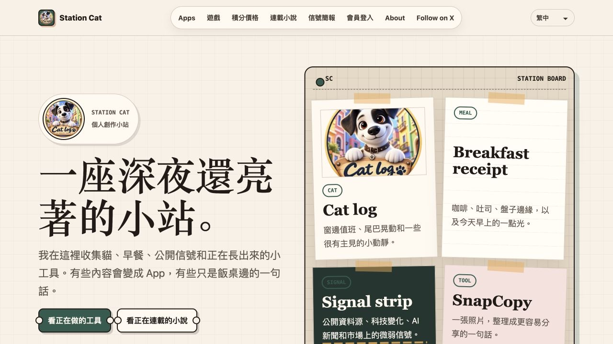

# Station Cat — 参考模板 #010

> 网址：https://wwwstationcat.org/

## 基本信息

- 名称：Station Cat
- 语言：提供繁体中文、简体中文、English、日本語切换入口
- 定位：**独立 App 与日常创作小站** —— 记录从零开始学开发、做产品的过程，把工具、网页游戏、连载小说与日常观察放在同一个个人品牌下
- GitHub：未在首页提供网站源码链接
- 社交：X [@statiocat](https://x.com/statiocat)

## 首页结构

1. **Hero / Station Board**：以「一座深夜還亮著的小站。」开场；右侧用 Cat log、Breakfast receipt、Signal strip、SnapCopy 四张纸片式卡片呈现日常与创作主题，提供工具和小说入口。
2. **About the station**：用「一張 0 基礎程式員的日常工作桌。」介绍学习开发、做产品、踩坑和持续创作的经历。
3. **Today at the Station**：将内容分成 Cat log、Table notes、Signal board、Tool bench，交代这座小站会持续记录什么。
4. **Tools on the bench**：陈列打工养猫日记、SnapCopy、花有数、NovelForge AI、猫栈拼音、SimpleCut Pro、NodePilot；每项附用途说明、发布或测试状态，以及详情、体验或下载入口。
5. **Serial fiction**：展示连载小说《离线未来》的故事简介、作品页与第一章阅读入口。
6. **Closing / Footer**：延续「小站还在慢慢长大」的叙事，提供 X、App、候补名单和支持等入口。

## 可作为模板吸收的设计要点

- **纸张与工作桌的视觉隐喻**：米色方格底纹、衬线大标题、墨绿点缀，配合胶带、拍立得式图片、纸片边框与轻微错位阴影，把多主题首页组织成个人工作桌。
- **生活细节建立个人辨识度**：猫、早餐与饭桌笔记和开发内容并置，让访客先认识创作者，再进入工具与作品。
- **真实作品承接首页叙事**：工具区按用途介绍产品，并直接给出发布状态和体验入口，让「正在做什么」有具体落点。
- **产品与长篇内容共存**：独立 App、浏览器游戏、连载小说和信号简报分别设入口，适合持续更新多种作品的个人站。
- **统一品牌下的语言入口**：导航提供四种语言选项，方便不同语言的访客寻找内容；各栏目实际翻译覆盖以网站为准。

## 适用人群

同时做产品、写作和日常内容的独立开发者与创作者，尤其适合希望公开记录学习与构建过程、用一个网站集中展示多种作品的人。

## 预览

以上基于公开首页的内容与视觉观察；截图为繁体中文首页，未对网站源码或后端实现作推断。
